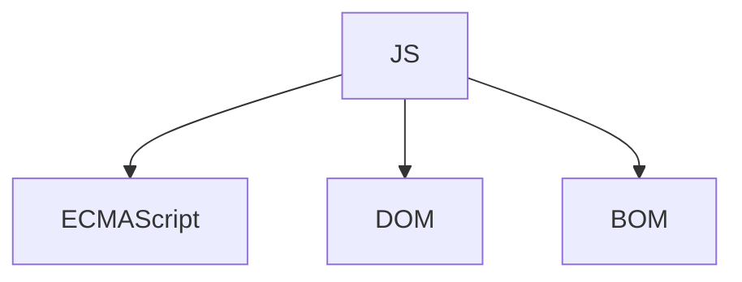

- 随处部署：服务器、桌面浏览器、手机浏览器、原生移动端
- Ajax jQuery
- 前端模型、数据绑定、路由管理、反应式视图
- ECMA 规范定义了 JavaScript
- 宿主提供的 API:DOM 网络请求、系统硬件、存储、事件、文件、加密
- 浏览器和引擎按照自己的理解实现这些规范
- JavaScript 20 年
- 闭包、匿名函数 元编程
- 宿主环境：web 浏览器 nodejs Flash
- Web 编程语言
- 高级、动态、解释性语言
- 面向对象、函数式编程
- 变量无类型
- 与`Java` 是不同的语言

---

- `1995` + 网景公司工程师
- Mocha（脚本语言）->LiveScript（后来改名）->JavaScript（在 Navigator 2 正式发布之前）
- 网景公司 + SUN 公司 --> 共同完成 LiveScript（后来改名）
- JavaScript 1.0 -->JavaScript 1.1（Navigator 3）
- 微软的 IE3：JScript （JavaScript 的实现）
- Ecma（1997 JavaScript1.1）
- TC39 （网景 Sun 微软）
- 网景公司+Sun+微软--》ECMA-262 （新的脚本语言标准）
- 各大浏览器实现
- 2008 年：
- DOM 标准：万维网联盟
- DOM Core :映射 XML 文档
- DOM HTML 特定于 HTML 的对象和方法

---

完整的`JavaScript` 包括：ECMA-262 定义的 + DOM + BOM

ECMA-262 定义的是 ECMAScript



---

语法、类型、语句、关键字、保留字、操作符、全局对象

| 版本         |                                                              |      |
| ------------ | ------------------------------------------------------------ | ---- |
| 1            | JavaScript 1.1（Navigator 3） 支持 Unicode 标准              |      |
| 2            | 编校工作                                                     |      |
| 3            | 更新：字符串处理、错误定义、数值输出、正则、try catch        |      |
| 4            | 彻底修订：强类型变量、新语句、数据结构、真正的类、经典的继承 |      |
| 5（ECMA3.1） | 新功能：JSON、严格模式                                       | 2009 |

| 版本             |               |                  |                                                                                                                             |
| ---------------- | ------------- | ---------------- | --------------------------------------------------------------------------------------------------------------------------- |
| 6                | ES6 ES2015    | 2015 年 6 月 ES6 | 正式支持了类、模块、迭代器、生成器、箭头函数、期约、反射、代理和众多新的数据类型                                            |
| ECMA-262 第 7 版 | ES7 或 ES2016 | 2016 年 6 月     | Array.prototype.includes 和指数操作符                                                                                       |
| ECMA-262 第 8 版 | Es8 ES2017    | 2017 年 6 月     | 异步函数（async/await）Object.values()/Object.entries()/Object.getOwnPropertyDescriptors()                                  |
| ECMA-262 第 9 版 | ES9、ES2018   | 2018 年 6 月     | 异步迭代 ；正则表达式；Promise finally()                                                                                    |
| 10               | ES10、ES2019  | 2019 年 6 月     | Array.prototype.flat()/flatMap()、String.prototype.trimStart()/trimEnd()、Object.fromEntries() Symbol.prototype.description |

---

DOM：删除、添加、替换、修改节点

有关 DOM 级别 对于浏览器来说，DOM 使用 ECMAScript 实现的。

|                              |                                                        |                           |
| ---------------------------- | ------------------------------------------------------ | ------------------------- |
| DOM1 （成为 W3C 的推荐版本） | DOM Core                                               | DOM Core 映射 XML 文档 ； |
| DOM1 （成为 W3C 的推荐版本） | + DOM HTML                                             | 特定于 HTML 对象方法      |
| DOM2                         | 目标变得宽泛、鼠标、用户界面事件、范围、遍历、支持 CSS |                           |
| DOM3                         |                                                        |                           |
| DOM4                         |                                                        |                           |

早期支持不同形态的 DHTML ，后来 W3C 制定 DOM 标准

BOM: 没有相关标准实现，后来出现`HTML5` ;针对浏览器窗口、浏览器子窗口、
扩展：弹出新窗口、移动、缩放、navigator、location、screen、performance、cookie 的支持

其他的 DOM

- 可伸缩矢量图 SVG
- 数学标记语言 MathML

---

`script` 网景创造 async charset defer type
解析资源 发送 get 请求 同源策略限制
放在 head 中页面需要等 js 的下载解析解释

都是适用于外部脚本
defer 4.01 （立即下载）整个页面解析完毕，然后脚本运行（延迟执行）
async （立即下载） 不必等脚本下载和执行后再加载页面
浏览器设置缓存所有外部链接
请求一批文件 放到浏览器缓存中
混杂模式 标准模式 CSS 渲染内容方面 准标准模式
标准模式是除混杂模式之外元素
typeof 关键字
标识符：变量、函数、属性或函数参数的名称 标识符建议驼峰
推荐加分号
严格模式

关键字、保留字
变量：var const let
for in 语句严格的迭代语句、枚举对象中的非符号键属性

```js
const s = Symbol('foo')

const o = {
  [s]: 'sym',
  name: '1',
  1: 1,
}

for (let key in o) {
  console.log(key)
}
```

标签语句

```js
start: for (let i = 0; i < 4; i++) {
  console.log(i)
}
```

原始值：
引用值：

函数的参数都是按值传递的。函数外的值会被复制到函数内部的参数
执行上下文
内存管理 :内存管理和垃圾回收都很特殊的环境

```js
// 没有参数
let nowDateObj = new Date() // 其中nowDateObj是Date 类型的对象 now instanceof Date
// 参数是经过的毫秒数
const startDateObj = new Date(0) // 其中startDateObj是Date 类型的对象 now instanceof Date
// 参数是时间戳
const nowObj = new Date(1663841841134) // 其中now是Date 类型的对象 now instanceof Date
// 参数是datestring
const date = new Date('2022-09-22') // 其中now是Date 类型的对象 now instanceof Date
// 参数
const d = new Date(2022, 08, 1)
```

## DOM

`DOM文档对象模型` ，是 HTML 和 XML 文档的编程接口，语言无关的表示操作网页的方式 DOM-API

`DOM Level 1` W3C 推荐标准 ：文档结构和查询的接口 Node 的接口 所有 DOM 节点必须实现的 继承 Node 共享相同的基本属性和方法

nodeName nodeValue 保存着有关节点的信息

```js
console.log('文档元素 <html>元素 documentElement')
console.log(
  '元素节点表示HTML元素 属性节点表示属性 文档类型节点表示文档类型 12种节点类型'
)
const pNode = document.querySelector('#is-p')
console.log(pNode)
console.log(pNode.nodeType, pNode.nodeName, pNode.nodeValue)
console.log(
  'nodeList 实例 同一个类数组对象 DOM结构的查询 实时的活动对象',
  pNode.childNodes
)

// 访问NodeList 中的元素

const nodeList = pNode.childNodes
const firstNode = nodeList[0]
const secNode = pNode.childNodes.item(1)
console.log(firstNode)
console.log(secNode)
```

```html
<p class="is-p-1">
  <span class="span-1"></span>
  <span class="span-2"></span>
</p>
<p class="is-p-2"></p>
<script>
  const pNode = document.querySelector('.is-p-1')
  console.log('指向DOM树中的父元素', pNode.parentNode) // body
  console.log(pNode.previousSibling) // text
  console.log(pNode.nextSibling) // text
  console.log(pNode.childNodes) // [text,span-1,text,span-2,text]

  console.log(pNode.firstChild) // text
  console.log(pNode.lastChild) // text

  const p2Node = document.querySelector('.is-p-2')
  console.log(p2Node.hasChildNodes()) // false
</script>
```

```js
/**
 * 移除节点
 */

const pNode = document.querySelector('.remove-p')
const PNodeChildNodes = pNode.childNodes
console.log(PNodeChildNodes)

// 删除第一个子节点

const ret = pNode.removeChild(pNode.firstChild)
```

| 功能点         |                                 |                                          |
| -------------- | ------------------------------- | ---------------------------------------- |
| 获取完整的 URL | document.URL                    | http://127.0.0.1:5500/src/DOM/index.html |
| 域名字符串     | document.domain                 |                                          |
| 获取 body 元素 | document.body                   |                                          |
| 获取 html 标签 | window.document.documentElement |                                          |

```js
// 文档子节点
/**
 * 获取html元素
 */

const html1 = window.document.documentElement // html 标签
// const html2 = window.document.childNodes[0] // html 标签
// const html3 = window.document.firstChild

// console.log(html1)
// console.log(html2)
// console.log(html3)

/**
 * 获取body元素
 */
const b = window.document.body
console.log(b)

/**
 * 获取doctype
 */
console.log(window.document)

for (let k in window.document) {
  // console.log(k)
}

// 文档信息 标准Document 对象的所没有的属性

/**
 * 读取文档标题
 */
const oT = document.title
console.log(oT)

/**
 * 获取完整的URL
 */

const u = document.URL //
console.log(u)

/**
 * 获取域名字符串
 */

const dM = document.domain
console.log(dM)
```

---

**HTML5** 新增

| 功能点     |                     |                      |
| ---------- | ------------------- | -------------------- |
| head 属性  | document.head       | 直接获得<head> 元素  |
| compatMode | document.compatMode | 检测页面渲染模式     |
| readyState | document.readyState | 判断文档是否记载完毕 |

- `DOM Core` 在 DOM1 核心部分的基础上 为节点增加方法和属性
- `DOM Views` 定义基于样式信息的不同视图
- `DOM Events` 定义通过事件实现 DOM 文档交互

样式 3 种定义方式 `外部样式表` `文档样式表` `元素特定样式`


```js

/**
 * File 类型
 * File API 仍然以表单中的文件输入字段为基础、但是增加直接反问文件信息的
 * name 本地系统中的文件名
 * size 字节大小
 * type MIME 类型的字符串
 * lastModifiedDate 只有Ch
 */

const fileList = document.getElementById('file-list')

fileList.addEventListener('change',(e)=>{


  let files = e.target.files,
  i=0,len = files.length

  while(i<len){
    const f = files[i]
    console.log(f)
    i++;
  }
})

```

一些工具：`npm`   

包管理：`npm` `yarn` `bower` `JSPM`
模块加载器：`SystemJS` `RequireJS`
模块打包器: Webpack JSPM Rollup
编译 Babel
类型：TypeScript Flow
高性能脚本工具 WebAssembly asm.js


/**
 * 背景：规范体系
 * 可维护性 容易理解、符合常识、容易扩展、容易调试
 * 编码规范：可读性、缩进使用空格数
 * 注释：函数方法、大型代码块、复杂的算法、使用黑科技
 * 变量和函数命名
 * 变量名是名词
 * 函数名是动词开始 doSome
 * 常量 STS_CODE
 * 松散耦合
 * 可维护性 性能优化 部署
 * 适合C语言的性能优化 使用switch
 * 限制DOM操作的数量
 * 编码 编译测试
 * 编码 测试
 * 传输负载 服务器发送给浏览器的实际字节数
 */

// 声明语句的时候一条语句
let a=1,b=2
/**
 * 尊重对象所有权
 * 
 */

```js
/**
 * 模块标识符 可能是字符串 模块文件的实际路径
 * 模块系统 键值实体
 * 原生浏览器模块标识符必须提供文件的路径
 * nodejs 搜索 node_modules 
 */

/**
 * 模块依赖 管理依赖
 */

/**
 * 模块加载
 * 加载模块的
 */

/**
 * 入口 代码的起点
 */
const globalData = ''

const Foo =  (function(){
  console.log('bar');
  

  return {

  }
})(globalData)

console.log(Foo);

```